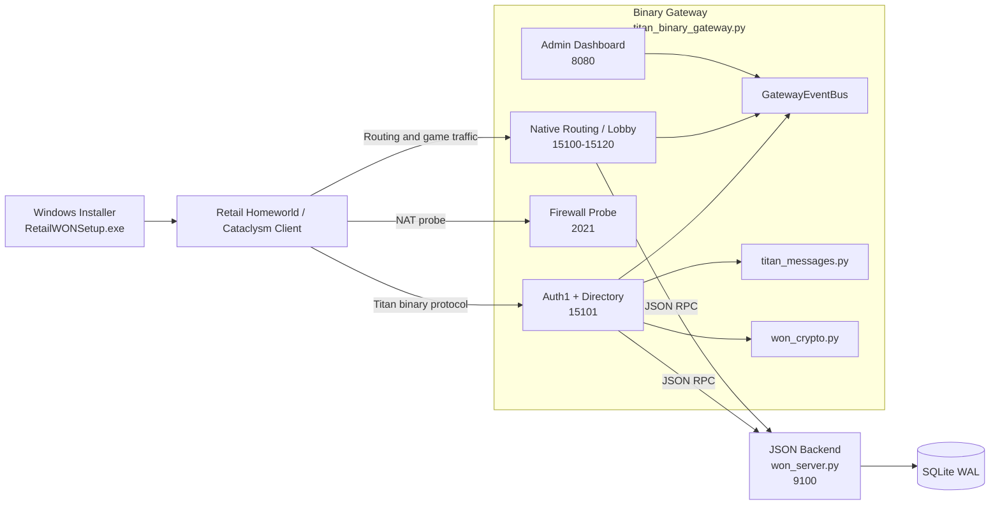

# Retail WON OSS Server

[](https://github.com/FlashZ/won_oss_server/actions/workflows/tests.yml)
[](https://www.gnu.org/licenses/agpl-3.0)
[](https://www.python.org/downloads/)
[](https://www.docker.com/)
[](https://en.wikipedia.org/wiki/Homeworld)
[](https://en.wikipedia.org/wiki/Homeworld:_Cataclysm)

Open-source replacement for the Sierra WON (World Opponent Network) backend services for the original retail Homeworld family. The repo now carries shared product profiles for **Homeworld 1** and **Homeworld: Cataclysm**, plus a unified Windows installer that can bootstrap either game.

The repo now supports:

- **single-product stacks** via `--product homeworld|cataclysm`
- an **experimental shared-edge mode** in `titan_binary_gateway.py --shared-edge` that can front both Homeworld and Cataclysm at once while keeping separate internal backends and routing ranges

The shared-edge path is intended for active testing and validation, not a “retail-perfect” claim yet. Cataclysm-specific bootstrap notes live in [docs/cataclysm-bootstrap-notes.md](docs/cataclysm-bootstrap-notes.md), and the architecture plan is tracked in [docs/unified-edge-two-backend-architecture.md](docs/unified-edge-two-backend-architecture.md). Homeworld Remastered Classic is not supported.

## Quick start (Docker)

```bash
cp .env.example .env        # then edit PRODUCT or SHARED_EDGE, plus PUBLIC_HOST, BACKEND_SHARED_SECRET, and ADMIN_TOKEN
docker compose up -d --build
```

This builds one Docker image, then runs the gateway plus the backend containers it needs for the selected mode:

- single-product mode: `backend`, `backend-cataclysm` (idle), and `gateway`
- shared-edge mode: `backend` (Homeworld), `backend-cataclysm` (Cataclysm), and `gateway`

Set `PRODUCT=homeworld` or `PRODUCT=cataclysm` in `.env` for a single-product stack. Set `SHARED_EDGE=1` to launch one public gateway that fronts both games at once while keeping separate internal backends and per-product data roots under `./data/<product>/`.

Ports to expose:

| Port | Purpose |
|------|---------|
| `15101/tcp` | Auth1 and directory queries |
| `15100-15120/tcp` | Routing, chat, and game rooms |
| `2021/tcp` | Firewall/NAT probe |

The admin dashboard is available at `http://127.0.0.1:8080/?token=...` on the host machine. In Docker, the dashboard is published through the gateway container, so `ADMIN_TOKEN` is required.

## Testing

Run the Python test suite locally from the repo root:

```bash
python -m pip install -r requirements-server.txt
python -m pip install pytest
python -m pytest
```

GitHub Actions runs the same suite on every push and pull request across Python 3.10, 3.11, and 3.12.

## Client setup

Distribute `RetailWONSetup.exe` to players. Run as Administrator.

The installer now auto-detects retail Homeworld and Cataclysm installs, prompts for the game when both are present, optionally writes a matching randomized retail CD key to the registry for the selected game, updates `NetTweak.script` to point at your server, and installs the shared `kver.kp` verifier key. No Python is required on client machines.

The bundled installer pool is still static at runtime, but you can now regenerate a much larger pool from the real retail algorithm with `generate_cdkeys.py` instead of hand-curating captured keys.

To rebuild the installer from source:

```powershell
installer\build_installer.bat
```

The default output artifact is `installer\RetailWONSetup.exe`. You can still override the filename with `INSTALLER_OUTPUT_NAME=...` when needed.

### How client bootstrap works

Two files control which server the game contacts:

- **`NetTweak.script`** - tells the retail client which directory/patch server to connect to (`DIRSERVER_IPSTRINGS`, `DIRSERVER_PORTS`, `PATCHSERVER_IPSTRINGS`, `PATCHSERVER_PORTS`). The installer updates these values while preserving the rest of the retail script (LAN settings, port tuning).
- **`kver.kp`** - the verifier public key the client uses to validate the server's Auth1 handshake.

Both must match the server you are running. If the host points at one server but the verifier key belongs to another, the client will connect but Auth1 will fail.

## Server setup (Python)

Install dependencies:

```powershell
python -m pip install -r requirements-server.txt
```

Optionally generate fresh keys (skip this to use the bundled key set):

```powershell
python generate_keys.py --keys-dir keys
```

Generate true retail-compatible Homeworld or Cataclysm CD keys:

```powershell
python generate_cdkeys.py --product Homeworld --count 10
python generate_cdkeys.py --product Cataclysm --count 25 --format csharp
```

`--format csharp` emits `RegistryCdKeyOption(...)` lines you can paste into an installer pool.

Start the backend and gateway in separate terminals:

```powershell
# Terminal 1 - backend
python won_server.py --product homeworld --host 127.0.0.1 --port 9100 --db-path data/homeworld/won_server.db

# Terminal 2 - gateway
python titan_binary_gateway.py `
  --product homeworld `
  --host 0.0.0.0 --port 15101 `
  --backend-host 127.0.0.1 --backend-port 9100 `
  --public-host 192.168.x.x `
  --routing-port 15100 `
  --admin-host 127.0.0.1 --admin-port 8080 `
  --keys-dir keys --log-level INFO
```

Set `--public-host` to the address clients will use to reach the server. Swap `homeworld` for `cataclysm` to run the Cataclysm profile instead.

Security defaults:

- The backend now defaults to `127.0.0.1` and only accepts non-loopback clients if you explicitly configure a matching shared secret with `won_server.py --shared-secret ...` and `titan_binary_gateway.py --backend-shared-secret ...`.
- The dashboard defaults to `127.0.0.1`. If you bind `--admin-host` to anything non-loopback, you must also set `--admin-token` and include it as `?token=...` in the dashboard URL.

### Docker details

Copy `.env.example` to `.env` and set at least `PUBLIC_HOST`, `BACKEND_SHARED_SECRET`, and `ADMIN_TOKEN`.

For a single-product stack, also set:

- `PRODUCT=homeworld` or `PRODUCT=cataclysm`
- `SHARED_EDGE=0`

For a dual-product shared edge, set:

- `SHARED_EDGE=1`
- `EDGE_DEFAULT_PRODUCT=homeworld` or `EDGE_DEFAULT_PRODUCT=cataclysm`
- `BACKEND_PORT=9100`
- `CATACLYSM_BACKEND_PORT=9101`

The compose layout keeps state under `data/<product>/`, so Homeworld and Cataclysm no longer share one flat DB/keys path by accident.

```bash
docker compose up -d --build   # start
docker compose logs -f backend gateway   # watch logs
docker compose down            # stop
```

Compose now starts two services from the same image:

- `backend` runs `won_server.py` on the internal Docker network only.
- `backend-cataclysm` runs the Cataclysm backend only when `SHARED_EDGE=1`; otherwise it stays idle.
- `gateway` runs `titan_binary_gateway.py` and publishes the retail-facing ports plus a localhost-only admin dashboard.

The shared `./data` bind mount now holds product-scoped state such as:

- `data/homeworld/won_server.db`
- `data/homeworld/keys/`
- `data/cataclysm/won_server.db`
- `data/cataclysm/keys/`

There is no custom Docker entrypoint or sidecar supervisor in this setup. Compose launches the Python commands directly, and the only bootstrap logic left is a small first-run seed step in the backend service command so `./data` starts with the bundled database and keys.

Useful environment knobs:

- `PRODUCT` selects the active profile for single-product mode. Use `homeworld` or `cataclysm`.
- `SHARED_EDGE=1` switches Docker into one-gateway/two-backend mode so Homeworld and Cataclysm can share the same public retail edge.
- `EDGE_DEFAULT_PRODUCT` chooses which product profile acts as the shared-edge default when an early request is ambiguous. Leave it at `homeworld` unless you have a reason to prefer Cataclysm.
- `PORT_BIND_IP` controls which host IP Docker publishes the retail ports on. Leave it at `0.0.0.0` for one stack, or pin separate stacks to separate host IPs.
- `BACKEND_SHARED_SECRET` is required in Docker because the gateway talks to the backend over the Compose bridge network instead of container-local loopback.
- `ADMIN_TOKEN` is required in Docker because the gateway must bind the dashboard on `0.0.0.0` inside the container before Docker can publish it back to `127.0.0.1` on the host.
- `BACKEND_PORT` and `CATACLYSM_BACKEND_PORT` choose the internal backend listener ports for shared-edge mode.
- `GATEWAY_PORT`, `ROUTING_PORT`, `ROUTING_MAX_PORT`, `FIREWALL_PORT`, and `ADMIN_PORT` let you remap the gateway listeners if needed.

Shared-edge mode uses the configured routing range for both games and lets the gateway split it internally between Homeworld and Cataclysm. With the defaults, Homeworld gets `15100-15109` and Cataclysm gets `15110-15120`.

To run both games together from Docker:

```bash
cp .env.example .env
# edit .env:
#   SHARED_EDGE=1
#   EDGE_DEFAULT_PRODUCT=homeworld
#   PUBLIC_HOST=your.public.ip.or.dns
#   BACKEND_SHARED_SECRET=...
#   ADMIN_TOKEN=...
docker compose up -d --build
docker compose logs -f gateway
```

On startup you should see log lines like:

- `Shared-edge runtime: homeworld ...`
- `Shared-edge runtime: cataclysm ...`
- `Titan binary gateway listening on (...) -> shared edge`

## Architecture



The server has two processes:

- **`won_server.py`** - product-aware JSON-RPC backend handling auth, lobbies, matchmaking, and game-launch lifecycle. Persists state to SQLite (WAL mode).
- **`titan_binary_gateway.py`** - product-aware binary protocol gateway that speaks the native Titan wire format. Handles Auth1 handshakes, directory queries, routing, the factory service, firewall probes, and the admin dashboard. Communicates with the backend over internal JSON-RPC.

Supporting modules:

- **`won_crypto.py`** - NR-MD5 signatures, ElGamal encryption, DER key encoding, Auth1 key block and certificate builders.
- **`titan_messages.py`** - Titan message schemas and codecs.

### What's implemented

- Full Auth1 handshake with signed certificates
- Encrypted Auth1Peer sessions for directory and factory requests
- Product profiles for Homeworld and Cataclysm
- Directory service returning auth, routing, factory, and version entries
- Native routing: client registration, chat, data relay, data objects, keepalives
- Legacy Silencer lobby/conflict protocol
- Factory service for dynamic game room port allocation
- Reconnect-to-match with a short grace window
- Push-based event delivery via `GatewayEventBus`
- Admin dashboard with live rooms, players, chat, logs, and database snapshot
- Unified Windows installer with per-game auto-detect and registry handling
- SQLite WAL persistence across restarts

### Known limitations

- **Shared edge is still experimental** - `titan_binary_gateway.py --shared-edge` now supports one public Titan edge with separate Homeworld and Cataclysm backends/routing ranges, but it still needs broader live-match validation before it should be treated as invisible-to-players production behavior.
- **Native auth is still lightweight** - Homeworld/Cataclysm Auth1 now decrypts the native login blob, requires explicit account creation on first use, rejects missing or invalid retail-format CD keys, and binds each username to its first successful CD key. The legacy JSON auth endpoint still auto-creates users and there is no global CD-key uniqueness enforcement yet.
- **NAT detection** - the firewall probe reply is implemented but strict-NAT behavior needs broader field testing.
- **Reconnect-to-match** - matches on player name and IP; needs wider real-world validation.
- **In-process routing** - routing rooms are managed in-gateway rather than spawning external `RoutingServHWGame` binaries.

## Roadmap

- **Decode gameplay packets** - the server relays `SendData`/`SendDataBroadcast` traffic as opaque bytes. Next step is classifying packet shapes and mapping them to in-game actions.
- **Match diagnostics** - once packets are decoded, surface match timelines, desync clues, and launch/end markers in the admin dashboard.
- **Match telemetry** - use decoded traffic for result summaries, lightweight stats, and more reliable reconnect/resync.

## Self-hosting with your own keys

The source code is public, but network identity is defined by the key material in `keys/`. The two private `.der` files are the sensitive part - do not publish them if you want to remain the sole operator of your network.
To run an independent network:

1. Generate a fresh key set: `python generate_keys.py --keys-dir keys`
2. Use a fresh hostname/IP and database.
3. If using Docker, place your key files in `./data/<product>/keys/` before first `docker compose up`.
4. Rebuild the installer with your host and `kver.kp` embedded (update `installer/hwclient_setup.cs`, then run `build_installer.bat`).
5. Distribute that installer to your players, or manually distribute `kver.kp` and a matching `NetTweak.script`.

Key rules:

- `kver.kp` must match the verifier keypair the server uses
- Every client on your network needs the matching `kver.kp`
- Clients using a different network's installer or `kver.kp` will not trust your server
- Reusing someone else's private keys joins their trust domain rather than creating your own
